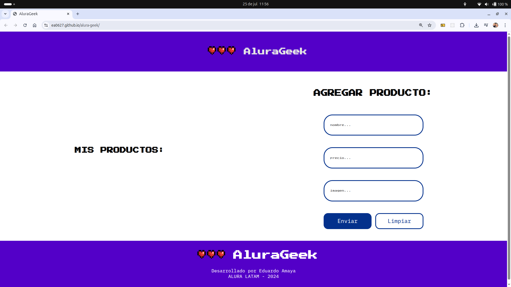

# 🛒 Alura Geek

Este proyecto es una tienda online simulada que permite gestionar productos dinámicamente a través de una interfaz amigable. Utiliza un servidor local con JSON Server para almacenar los datos, y JavaScript para interactuar con la API y renderizar el contenido en tiempo real.

---

## 🔗 Vista en vivo

👉 [Ver proyecto en GitHub Pages](https://ea0627.github.io/alura-geek)

---

## ⚙️ Funcionalidades implementadas

- 📦 Visualización dinámica de productos desde una API local.
- ➕ Agregar nuevos productos con validaciones de formulario.
- 🗑️ Eliminar productos de la tienda.
- 🧠 Autenticación básica simulada.
- 🔄 Actualización de contenido en tiempo real.
- 🎨 Estilo responsivo con diseño moderno.

---

## 🛠️ Tecnologías usadas

- HTML5 + CSS3
- JavaScript (ES6+)
- JSON Server (API local)
- Flexbox + Grid Layout
- Git + GitHub Pages

---

## 📁 Estructura del Proyecto

```
alura-geek/
├── assets/              # Imágenes y recursos
├── css/
│   └── style.css
├── js/
│   ├── main.js
│   ├── productos.js
│   └── validar.js
├── db.json              # Base de datos local simulada
├── index.html
└── README.md
```

---

## 📸 Captura de pantalla



---

## 👨‍💻 Autor

**Eduardo Amaya**  
Desarrollador Web Junior  
Bootcamp TripleTen  

📬 eduardo.amaya627@gmail.com  
🔗 [GitHub @ea0627](https://github.com/ea0627)

---

## 📌 Notas adicionales

- Este proyecto fue desarrollado como parte del curso de e-commerce del programa ONE (Oracle Next Education + Alura Latam).
- El archivo `db.json` actúa como servidor local de datos con JSON Server.
- Futuras mejoras: login real, persistencia con Firebase, y panel administrativo.

---

> Gracias por visitar este proyecto. ¡Seguimos construyendo ideas en código! 🧱🚀
